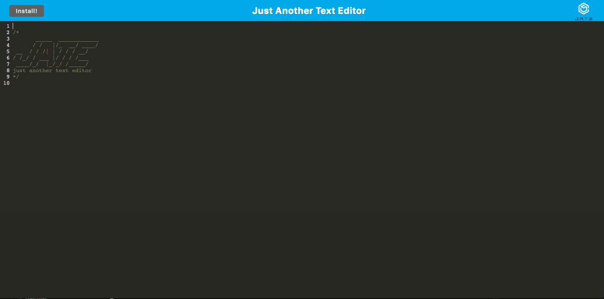

# challenge-19-text-editor

## Description

In this weeks challenge I was tasked to complete the code for a text editor that can be reached and edited with or without internet. In the text editor web application all the files are bundled up using webpack, and the text editor functions within the browser with no issues. The IndexDb creates a database storage immediately. All the content that is typed in, still apears on the page incase the user clicks off or refreshes the page. The data/ content is retrieved from the IndexDb storage database. The application is installable. The user is able to install the app simplely by clicking the install button. The application will be saved on your desktop with the icon. The loaded web app will has a regisered service worker, and all the static assets are pre cached upon loading.  

## Installation

For this application to work you will need webpack, concurrently, ans babel. 

## Usage

This is a great application for any user that is looking for a sipmle and userfriendly text editor that could be used with or without internet. It is also intallable to make for a easy access applicatioin will all your saved data. 

https://github.com/vitafomin/challenge-19-text-editor
https://intense-depths-68196-45de3f6e4f00.herokuapp.com/

## Credits

N/A

## License

Please refer to the LICENSE in the repo